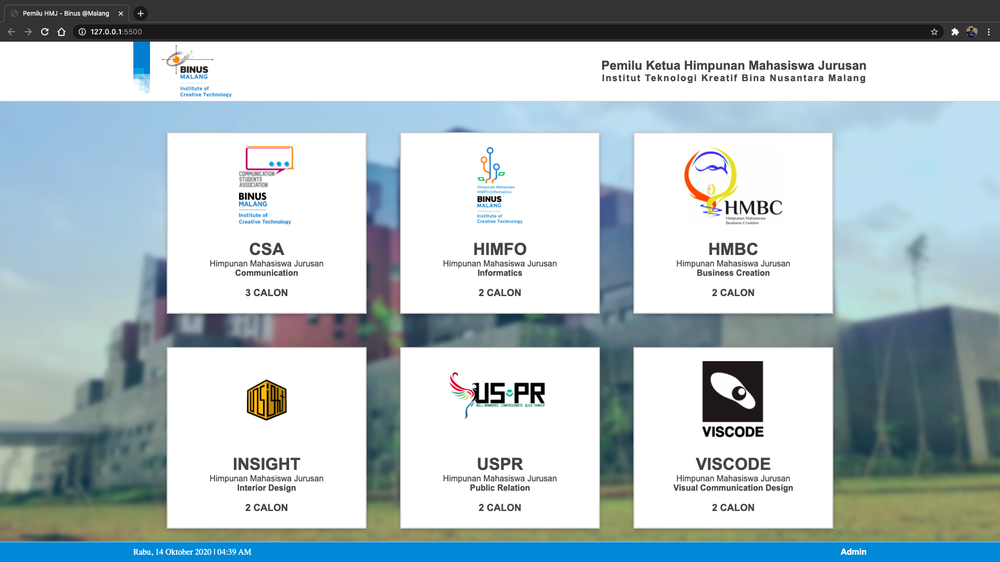
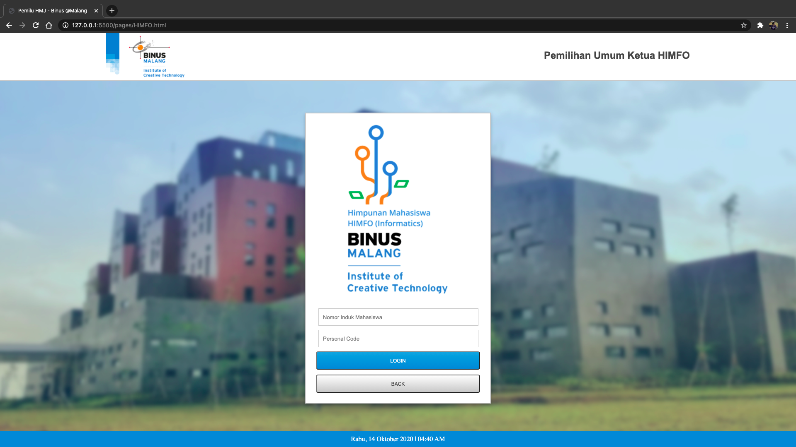
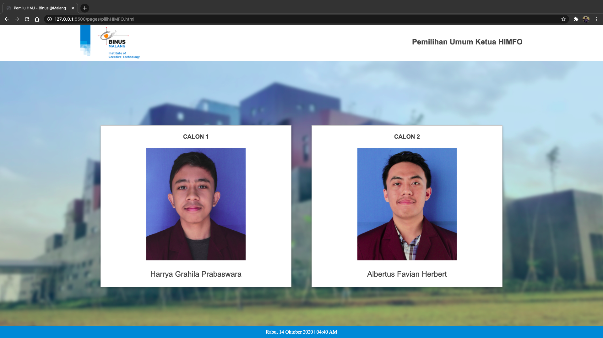

**Pilih bahasa:** 
[English](./README.md) | [Bahasa Indonesia](./README_bahasa.md)

# Website Pemilihan Umum untuk Ketua Himpunan Mahasiswa Jurusan (Front-end)
> Sebuah aplikasi web yang dibangun sebagai sarana bagi mahasiswa Bina Nusantara University @Malang untuk memilih calon ketua dari Himpunan Mahasiswa sesuai dengan jurusannya masing-masing. Pengerjaan proyek ini didukung oleh Student Advisory and Development Center (SADC) BINUS University @Malang dan Himpunan Mahasiswa Informatika (HIMFO).

## Teknologi yang Digunakan
* HTML
* CSS 

## Yang Saya Pelajari
* Penggunaan HTML dan CSS untuk membangun tampilan dari sebuah website, tanpa campur tangan dari framework apapun.
* Manajemen waktu, karena waktu pengerjaan yang cukup singkat (3 minggu) untuk saya yang baru mempelajari dan terlibat dalam proyek pengembangan website.

## Tangkapan Layar
#### Halaman Utama:

#### Halaman Login:

#### Halaman Pemilihan:
